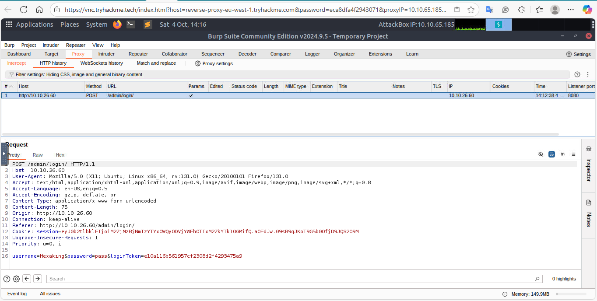
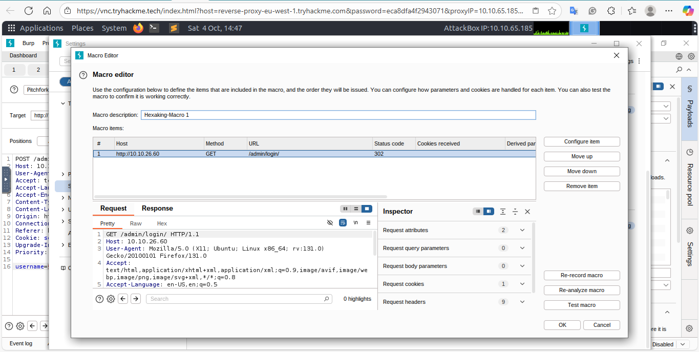
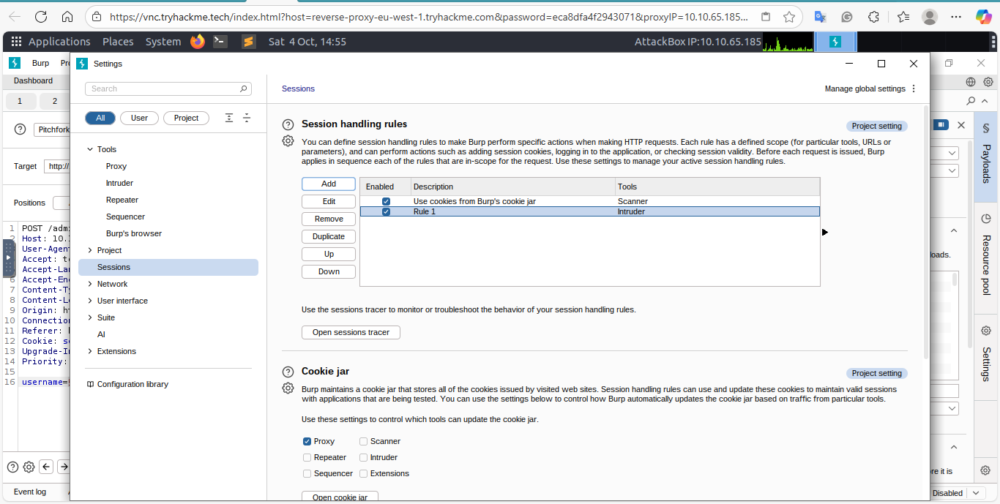
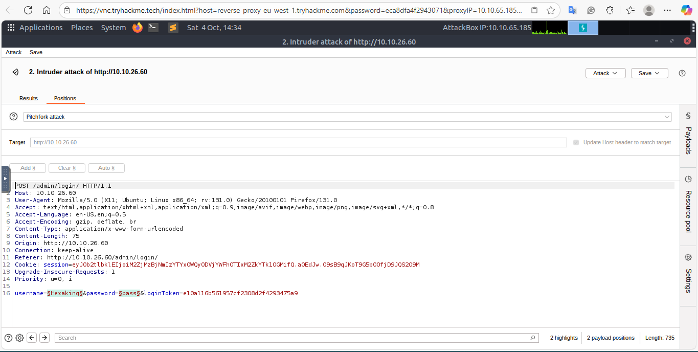
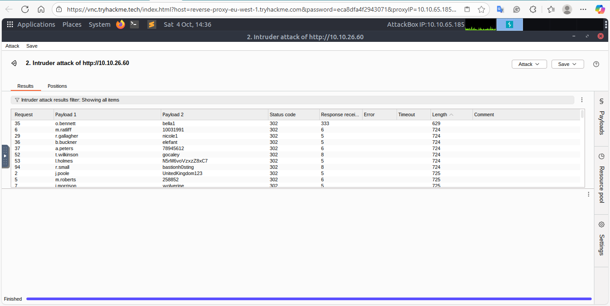

# BurpSuite Journal — Task 12: Extra Mile — Credential Stuffing (Macro + Session Handling)

**Lab:** Task 12 — Extra Mile Challenge (Credential stuffing with CSRF & rotating session cookie)

**Target:** `http://10.10.31.108/admin/login/`

**Author:** Uzodinma Kingsley Chibugom
**Date:** 2025-10-04

---

## Objective

Perform a credential-stuffing / brute-force style attack against the admin login page where the site issues a rotating `session` cookie and a per-request `loginToken` (CSRF token). Use Burp Macros + Session Handling Rules to fetch fresh tokens/cookies before every Intruder request.

## Environment / Prerequisites

* Burp Suite (Recommended for macros & session handling comfort)
* Proxy configured (browser -> Burp)
* Wordlists: username and password lists previously used in support-login attack
* Target in scope: `http://10.10.31.108/`


---

## Summary of approach

1. Capture a login GET/POST interaction to identify rotating values: `session` cookie and hidden `loginToken` field.
2. Create a Burp Macro that issues a GET request to `/admin/login/` to obtain fresh `session` & `loginToken` before each Intruder request.
3. Create a Session Handling Rule that runs the macro for Intruder, and configures it to only update the `loginToken` parameter and `session` cookie.
4. Configure Intruder with `Pitchfork` attack type and two payload positions (username, password). Load username/password lists.
5. Run attack; sort results by length to find shorter responses that indicate successful login redirect.
6. Use found credentials to log in manually.

---

## Capturing the request (example)

* Visit `http://10.10.31.108/admin/login/` with Burp Proxy intercept enabled.
* Example response shows a `Set-Cookie: session=...` header and a hidden input:

```html
<input type="hidden" name="loginToken" value="84c6358bbf1bd8000b6b63ab1bd77c5e">
```

* Both `session` and `loginToken` change on each page refresh.

---

## Create the Macro

1. In Burp -> **Proxy -> HTTP history**, find a GET to `/admin/login/` (or browse the page in your browser to generate one).
2. Go to **User options (or Settings) -> Sessions -> Macros** and click **Add**.
3. Select the GET request you captured and click **OK**. Name the macro (e.g., `get-admin-login-token`).

**What the macro does:** Issue a GET `/admin/login/` and return the response containing fresh `loginToken` and `Set-Cookie: session=...` header.

---

## Create Session Handling Rule

1. In **Sessions** -> **Session Handling Rules**, click **Add**.
2. Give it a description (e.g., `Run macro to refresh loginToken & session for Intruder`).
3. Scope: switch to **Scope** tab — Tools Scope: deselect everything except **Intruder**. URL Scope: set to suite scope or custom scope containing `http://10.10.31.108/`.
4. Back on **Details** tab, in **Rule Actions** click **Add** → **Run a macro** → select the macro created earlier.
5. Choose **Update only the following parameters and headers** and add `loginToken`.
6. Choose **Update only the following cookies** and add `session`.
7. Click **OK** to save the rule.

**Result:** Before each Intruder request, Burp will run the macro and replace only `loginToken` and `session` with fresh values.

---

## Intruder configuration

1. Capture a login POST and **Send to Intruder**.
2. **Positions** tab:

   * Clear predefined positions.
   * Select only the `username` and `password` form fields as payload positions (two positions).
   * Set **Attack type** to **Pitchfork** (username and password lists will be iterated in parallel).
3. **Payloads** tab:

   * Payload set 1: username wordlist (same list used in support-login task)
   * Payload set 2: password wordlist (same list used in support-login task)
4. **Start attack**.

**Note:** I used Pitchfork because we want to pair username and password entries from the lists in parallel (aligned). The macro will supply the fresh CSRF/cookie.

---

## Expected responses & validation

* Successful login attempts will redirect (HTTP `302`) and commonly produce a **significantly shorter response body** than failed attempts. Sort results by **Length** to locate anomalies.
* If you see `403` responses frequently, the macro/session handling is likely not configured correctly.

---

## Findings (results)

* The successful credential pair discovered during the attack was:

```
o.bennett:bella1
```

* Confirmed by manually refreshing `/admin/login/`, then logging in with the credentials.

---

## Screenshots (required for repo lab preview)



 — Session Handling Rule details (showing updated parameter & cookie)
  — Intruder positions & payloads loaded
 - Sorted Intruder results by length showing the successful entry

## Lab notes & tips

* Always set your target in Burp's scope to avoid running macros on unintended hosts.
* When building macros, ensure the captured request is exactly the one that returns the `loginToken` and `session` header.
* If 403s appear, check that the macro runs correctly and that the Session Handling Rule is scoped to Intruder.
* If you want an automated sequence that does everything without manual macros, Burp Extensions and macros combined with more advanced rules can sometimes help; for this lab the macro approach is simplest and robust.


## References

* Burp Suite docs: Session handling & macros (useful to review if things go wrong)

---

### End of journal entry

*Prepared for inclusion in the `burpsuite` repo. — Kingsley Chibugom Uzodinma (Hexaking)*
